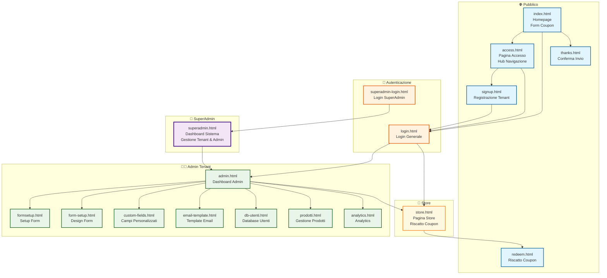

# 🗺️ Mappatura View CouponGen

## 📊 Diagramma Architettura View



## 📋 Dettaglio View

### 🌐 **Pubblico** (Accesso libero)
| View | Route | Descrizione | Ruolo |
|------|-------|-------------|-------|
| `index.html` | `/` | Homepage con form coupon | Pubblico |
| `access.html` | `/access` | Hub navigazione per accessi | Pubblico |
| `signup.html` | `/signup` | Registrazione nuovo tenant | Pubblico |
| `thanks.html` | `/thanks` | Conferma invio coupon | Pubblico |
| `redeem.html` | `/redeem/:code` | Riscatto coupon con QR | Pubblico |

### 🔐 **Autenticazione**
| View | Route | Descrizione | Ruolo |
|------|-------|-------------|-------|
| `login.html` | `/login` | Login generale (admin/store) | Autenticazione |
| `superadmin-login.html` | `/superadmin-login` | Login dedicato superadmin | Autenticazione |

### 👑 **SuperAdmin** (1 solo utente)
| View | Route | Descrizione | Ruolo |
|------|-------|-------------|-------|
| `superadmin.html` | `/superadmin` | Dashboard sistema completo | SuperAdmin |

### 👨‍💼 **Admin Tenant** (Per ogni tenant)
| View | Route | Descrizione | Ruolo |
|------|-------|-------------|-------|
| `admin.html` | `/admin` | Dashboard principale admin | Admin |
| `formsetup.html` | `/formsetup` | Setup configurazione form | Admin |
| `form-setup.html` | `/form-design` | Personalizzazione estetica form | Admin |
| `custom-fields.html` | `/custom-fields` | Gestione campi personalizzati | Admin |
| `email-template.html` | `/admin/email-template` | Template email coupon | Admin |
| `db-utenti.html` | `/db-utenti` | Database utenti registrati | Admin |
| `prodotti.html` | `/prodotti` | Gestione prodotti/servizi | Admin |
| `analytics.html` | `/analytics` | Statistiche e analytics | Admin |
| `account.html` | `/account` | Gestione profilo utente admin | Admin |

### 🏪 **Store** (Per ogni tenant)
| View | Route | Descrizione | Ruolo |
|------|-------|-------------|-------|
| `store.html` | `/store` | Pagina store per riscatto | Store |

## 🔄 **Flussi di Navigazione**

### 1. **Flusso Pubblico**
```
Homepage → Form Coupon → Thanks
Homepage → Access → [Signup | Login] → Admin/Store
```

### 2. **Flusso SuperAdmin**
```
SuperAdmin Login → Dashboard Sistema → Gestione Tenant/Admin
```

### 3. **Flusso Admin Tenant**
```
Login → Dashboard Admin → [Form Setup | Analytics | Prodotti | etc.]
```

### 4. **Flusso Store**
```
Login → Pagina Store → Riscatto Coupon
```

## 🏗️ **Architettura Multi-Tenant**

### Route Pattern
- **Legacy**: `/admin`, `/store`, `/analytics`
- **Multi-tenant**: `/t/:tenantSlug/admin`, `/t/:tenantSlug/store`

### Gerarchia Ruoli
1. **SuperAdmin** → Gestisce tutto il sistema
2. **Admin** → Gestisce il proprio tenant
3. **Store** → Gestisce solo la pagina store del proprio tenant

## 🔒 **Controlli Accesso**

| View | Controllo | Middleware |
|------|-----------|------------|
| Pubblico | Nessuno | - |
| Login | Redirect se autenticato | - |
| SuperAdmin | `userType === 'superadmin'` | `requireSuperAdmin` |
| Admin | `userType === 'admin'` | `requireRole('admin')` |
| Store | `userType === 'store'` | `requireRole('store')` |

## 📱 **Responsive Design**
Tutte le view sono responsive e ottimizzate per:
- Desktop (1200px+)
- Tablet (768px - 1199px)  
- Mobile (< 768px)
