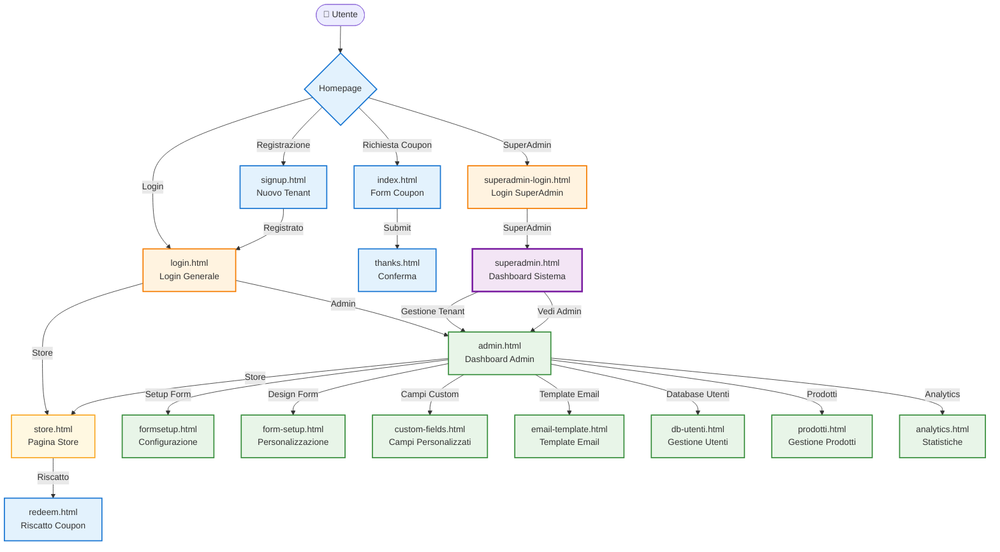

# 🔗 Relazioni tra View CouponGen

## 📊 Diagramma Relazioni Dettagliate



## 🎯 **Punti di Accesso Principali**

### 1. **Homepage** (`index.html`)
- **Entry point** principale del sistema
- Form per richiesta coupon
- Link a registrazione e login
- Accesso discreto a superadmin

### 2. **Login** (`login.html`)
- **Hub di autenticazione** per admin e store
- Redirect automatico in base al ruolo
- Supporto multi-tenant

### 3. **SuperAdmin Login** (`superadmin-login.html`)
- **Accesso dedicato** per superadmin
- Separato dal login normale
- Controlli di sicurezza specifici

## 🔄 **Flussi di Business**

### **Flusso Coupon Completo**
```
Homepage → Form Coupon → Thanks → Email → Riscatto
```

### **Flusso Registrazione Tenant**
```
Homepage → Signup → Login → Admin Dashboard
```

### **Flusso Gestione Admin**
```
Login → Admin Dashboard → [Setup | Analytics | Prodotti | etc.]
```

### **Flusso SuperAdmin**
```
SuperAdmin Login → Dashboard Sistema → Gestione Tenant/Admin
```

## 🏗️ **Architettura Multi-Tenant**

### **Route Pattern**
```
Legacy:     /admin, /store, /analytics
Multi-tenant: /t/:tenantSlug/admin, /t/:tenantSlug/store
```

### **Isolamento Tenant**
- Ogni tenant ha le proprie view isolate
- Middleware `tenantLoader` per caricamento tenant
- Controlli `requireSameTenantAsSession` per sicurezza

## 🔒 **Controlli di Accesso**

### **Livelli di Protezione**
1. **Pubblico** - Nessun controllo
2. **Autenticato** - Richiede login
3. **Ruolo Specifico** - Richiede ruolo admin/store
4. **SuperAdmin** - Richiede ruolo superadmin
5. **Tenant-Specifico** - Richiede appartenenza al tenant

### **Middleware Utilizzati**
- `requireAuth` - Autenticazione base
- `requireRole('admin')` - Ruolo admin
- `requireRole('store')` - Ruolo store  
- `requireSuperAdmin` - Ruolo superadmin
- `requireSameTenantAsSession` - Stesso tenant

## 📱 **Responsive Design**

### **Breakpoints**
- **Mobile**: < 768px
- **Tablet**: 768px - 1199px
- **Desktop**: 1200px+

### **View Ottimizzate**
- Tutte le view sono responsive
- Navigation mobile-friendly
- Form ottimizzati per touch

## 🎨 **Design System**

### **Colori Principali**
- **Primary**: Verde (#2d5a3d)
- **Secondary**: Accent verde (#4caf50)
- **Background**: Cream (#faf8f5)
- **Text**: Dark (#2c3e50)

### **Componenti Condivisi**
- Navigation bar
- Form styles
- Button styles
- Card layouts
- Modal dialogs
